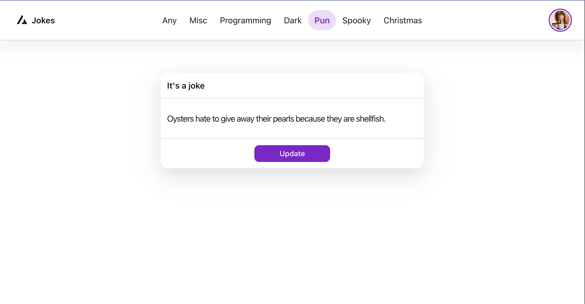

# Генератор шуток 

Приложение для генерации шуток с использованием [jokesApi](https://jokeapi.dev/)

## 🚀 Для запуска проекта выполни следующие шаги
1. Склонируй этот репозиторий, выполнив команду: `git clone https://github.com/tamaradzhahparova/jokesApp.git`;
2. Чтобы перейти в директорию с проекта, после клонирования выполни команду `cd jokesApp`;
3. Чтобы установить зависимости проекта, выполни команду `npm install`;
4. Чтобы запустить проект, выполни  команду `npm run start`;
5. Приложение запустится в браузере на http://localhost:3000.  

## Технологии
- [React](https://ru.reactjs.org/)
- [React-router-dom](https://v5.reactrouter.com/web/guides/quick-start)
- [axios](https://axios-http.com/ru/docs/intro)
- [NextUi](https://nextui.org/)

## Функционал
1. В шапке профиля можно выбрать категорию шуток 
2. Можно обновить шутку по клику на кнопку "обновить" 
3. Шутка обновляется при перезагрузке страницы

